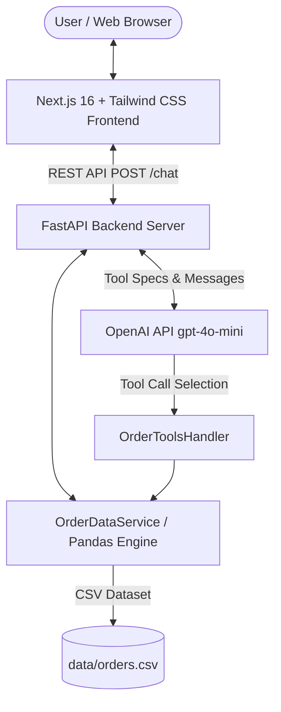

# Technical Architecture & Assessment Writeup

**Project Name:** AI Order Assistant  
**Author:** AI Fellowship Candidate  
**Date:** October 2026  

---

## 1. System Architecture

The AI Order Assistant is built as a decoupled, full-stack web application designed for interactive natural-language data querying and analytics over order records.



### Architectural Components:

1. **Frontend Layer (Next.js 16 / TypeScript / Tailwind CSS)**:
   - Client-side application rendering a responsive chat interface.
   - Built-in conversation state management, message copy functionality, error alerts, and example query prompts.
   - Leverages `react-markdown` and `remark-gfm` to format data tables, lists, and bold statistics cleanly.
   - Displays real-time connection status (`/health`) and tool invocation badges for full transparency into AI decision-making.

2. **Backend Service Layer (Python FastAPI / Uvicorn)**:
   - High-throughput asynchronous REST API exposing `POST /chat` and `GET /health`.
   - Strict request body validation via Pydantic (`ChatRequest`, `ChatMessage`).
   - CORS middleware configured for secure cross-origin communication between Vercel frontend and Render backend.

3. **Data Service Layer (`OrderDataService` / Pandas)**:
   - In-memory Pandas DataFrame loaded from `data/orders.csv`.
   - Normalizes data types (string cleaning, datetime conversion, numeric coercions).
   - Provides deterministic computational methods: `lookup_order`, `filter_orders`, and `analyze_orders`.

4. **AI & Function Calling Layer (`AIService` & `OrderToolsHandler`)**:
   - Manages the OpenAI Chat Completion tool loop.
   - Defines strict JSON Schema specifications for functions (`OPENAI_TOOLS`).
   - Routes model function calls directly to `OrderDataService` methods, ensuring all calculations are calculated dynamically from data without hallucination.

---

## 2. OpenAI Tool Calling Implementation

The application uses genuine OpenAI function calling (`tools` parameter in `chat.completions.create`).

### Registered AI Tools:

1. `lookup_order(order_id: str)`:
   - **Purpose:** Retrieves complete record details for a specific order ID.
   - **Handling:** Performs case-insensitive matching and handles missing "ORD-" prefixes (e.g., input "1001" automatically resolves to "ORD-1001").

2. `filter_orders(category?, city?, status?, start_date?, end_date?)`:
   - **Purpose:** Searches for orders matching combinations of category, city, order status, or date range.
   - **Output:** Returns matching count, formatted order list, and summary totals.

3. `analyze_orders(metric: str, category?, city?, status?, month?, year?)`:
   - **Supported Metrics:** `total_revenue`, `avg_order_value`, `order_count`, `customer_ranking`, `top_product`, `category_breakdown`, `city_breakdown`, `status_breakdown`.
   - **Output:** Aggregated financial statistics, customer spend rankings, or category/city percentage breakdowns.

### Tool Execution Loop:

```python
# Iterative tool calling turn loop in AIService:
response = client.chat.completions.create(
    model="gpt-4o-mini",
    messages=messages,
    tools=OPENAI_TOOLS,
    tool_choice="auto"
)

if response.choices[0].message.tool_calls:
    for tool_call in response.choices[0].message.tool_calls:
        result = tools_handler.execute_tool(tool_call.function.name, tool_call.function.arguments)
        messages.append({
            "role": "tool",
            "tool_call_id": tool_call.id,
            "name": tool_call.function.name,
            "content": json.dumps(result)
        })
    # Follow-up request to generate final natural language response
```

---

## 3. Guardrails, Safety & Error Handling

To ensure production stability and reliability:

1. **Input Validation**:
   - Pydantic models reject empty strings, whitespace-only messages, and payloads exceeding character limits.
   - API returns structured HTTP 400/422 responses on invalid input.

2. **OpenAI API & Environment Guardrail**:
   - If `OPENAI_API_KEY` is not set or the OpenAI API experiences downtime (quota limits, network timeout), `AIService` seamlessly transitions to an internal rule-based local parser.
   - The user is notified gracefully without app crashes or raw stack traces.

3. **Data Integrity & Zero-Hallucination Policy**:
   - System instructions explicitly direct the AI to rely exclusively on tool outputs for financial numbers, order IDs, and status reports.

4. **Response Capping**:
   - Order list results in `filter_orders` are capped at 50 records per tool invocation to prevent prompt token bloat while keeping total counts accurate.

5. **Secrets Management**:
   - Secrets (`OPENAI_API_KEY`) are restricted to backend environment variables and never exposed to frontend code or committed to Git (`.gitignore` enforced).

---

## 4. Deployment Strategy

- **Backend (Render)**:
  - Deployed as a Python Web Service.
  - Controlled via `render.yaml` and `backend/Procfile`.
  - Serves API at port `$PORT` via Uvicorn.
  
- **Frontend (Vercel)**:
  - Deployed as a Next.js App Router application.
  - `NEXT_PUBLIC_BACKEND_URL` environment variable points to the Render backend domain.

---

## 5. Potential Future Improvements

1. **Database Integration**: Replace CSV with PostgreSQL + SQLAlchemy / Prisma to handle millions of records with index-accelerated queries.
2. **File Upload & Custom Datasets**: Allow users to drag and drop custom order CSV files in the frontend UI for instant AI analytics.
3. **Interactive Charts**: Render visual bar charts, line graphs, and pie charts using Chart.js or Recharts alongside Markdown text responses.
4. **Export & Reporting**: Add a button to export query results and analytics summaries to PDF or Excel format.
5. **Caching Layer**: Implement Redis caching for frequent analytical metrics (e.g. total monthly revenue) to reduce computational latency.

---

## 6. AI Tools Used

During the development of this project, the following AI tools and workflows were utilized:
- **Google Antigravity Agentic Assistant**: Used for iterative full-stack planning, backend architecture implementation, pandas query formulation, Pytest test creation, and Next.js frontend design.
- **OpenAI GPT-4o-mini**: Integrated directly into the application backend as the intelligence engine responsible for tool selection, argument extraction, and natural language synthesis.
