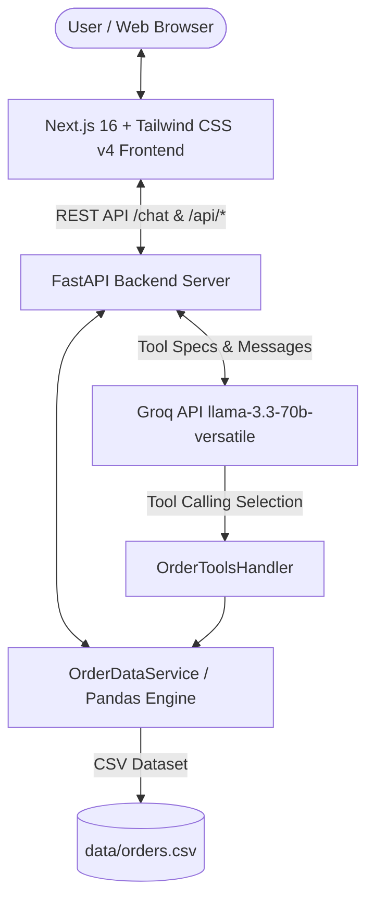

# Technical Architecture & Assessment Writeup

**Project Name:** Order Assistant — AI E-Commerce Analytics Workspace  
**Live Web App:** [https://order-assistant-lemon.vercel.app/](https://order-assistant-lemon.vercel.app/)  
**Backend API Docs:** [https://order-assistant-3owc.onrender.com/docs](https://order-assistant-3owc.onrender.com/docs)  
**GitHub Repository:** [https://github.com/chxisty/order-assistant](https://github.com/chxisty/order-assistant)  
**Date:** October 2026  

---

## 1. System Architecture

The AI Order Assistant is built as a decoupled, full-stack web application designed for interactive natural-language data querying, order dataset lookup, and executive sales analytics over order records.



### Architectural Components:

1. **Frontend Layer (Next.js 16 / TypeScript / Tailwind CSS v4)**:
   - Modern, dark-themed SaaS workspace rendering a responsive collapsible left sidebar (`#0D1428`), top navigation header with global search, welcome hero card, 4 dynamic KPI cards, a 2-column analytics preview (monthly area chart & status donut chart), quick actions, order lookup inspector, and interactive AI chat.
   - Built-in theme state management (`ThemeContext`) supporting Dark Navy (`#080D1B`) and Light themes with `localStorage` persistence.
   - Uses `recharts` for visual data charts and `react-markdown` with `remark-gfm` to format data tables, lists, and executive summaries cleanly.
   - Displays real-time backend connection status (`/health`), loaded order counts (`60 Orders`), active model indicators (`Groq AI`), and tool invocation badges.

2. **Backend Service Layer (Python FastAPI / Uvicorn)**:
   - Asynchronous REST API exposing `/health`, `/chat` (`/api/chat`), `/api/dashboard/stats`, `/api/dashboard/insights`, and `/api/orders/{order_id}`.
   - Strict request body validation via Pydantic (`ChatRequest`, `ChatMessage`, `DashboardFilterRequest`).
   - CORS middleware enabled for secure cross-origin communication between the Vercel frontend and Render backend.

3. **Data Service Layer (`OrderDataService` / Pandas)**:
   - In-memory Pandas DataFrame initialized from `data/orders.csv` (60 verified order records).
   - Normalizes data types (string trimming, datetime parsing, numeric coercions).
   - Provides deterministic computational tools: `lookup_order`, `filter_orders`, `analyze_orders`, and `get_dashboard_stats`.

4. **AI & Tool Calling Layer (`AIService` & `OrderToolsHandler`)**:
   - Manages official Groq Python SDK (`groq` v1.7.0) tool-calling loops using model `llama-3.3-70b-versatile` and Base URL `https://api.groq.com/openai/v1`.
   - Defines strict tool specifications (`GROQ_TOOLS`) for `lookup_order`, `filter_orders`, and `analyze_orders`.
   - Routes model tool calls directly to `OrderDataService` computational methods, ensuring all financial statistics and order details are calculated directly from verified data without hallucination.

---

## 2. Groq Tool Calling Implementation

The backend uses tool calling via the official `groq` Python SDK (`llama-3.3-70b-versatile`).

### Registered AI Tools:

1. `lookup_order(order_id: str)`:
   - **Purpose:** Retrieves complete record details for a specific order ID (e.g. `ORD-1001`).
   - **Handling:** Performs case-insensitive matching and handles missing "ORD-" prefixes (e.g., input "1001" automatically resolves to "ORD-1001").

2. `filter_orders(category?, city?, status?, start_date?, end_date?)`:
   - **Purpose:** Filters orders matching any combination of product category, city, order status, or date range.
   - **Output:** Returns matching count, formatted record list, and total financial amounts.

3. `analyze_orders(metric: str, category?, city?, status?, month?, year?)`:
   - **Supported Metrics:** `total_revenue`, `avg_order_value`, `order_count`, `customer_ranking`, `top_product`, `category_breakdown`, `city_breakdown`, `status_breakdown`.
   - **Output:** Calculated revenue metrics, customer spend rankings, or category/city percentage breakdowns.

---

## 3. Guardrails, Safety & Local Fallback Engine

To guarantee 100% production reliability even during external API downtime:

1. **Deterministic Local Fallback Engine**:
   - If `GROQ_API_KEY` is missing, or if Groq API requests hit rate limits or quota limits, `AIService` seamlessly transitions to an internal rule-based local parser.
   - The fallback engine parses user intents, invokes the appropriate pandas data tool, and returns verified results clearly labeled with `*(Groq API Error: Switched to local data engine)*`.

2. **Input Validation & Guardrails**:
   - Pydantic models reject empty strings and malformed JSON payloads, returning HTTP 400/422 status codes.

3. **Data Integrity & Zero-Hallucination Policy**:
   - System prompts instruct the model to rely exclusively on tool outputs for financial numbers, order counts, and status reports.

---

## 4. Testing & Verification

The project includes an automated Pytest test suite with **33 passing tests**:

- `backend/tests/test_api.py`: Tests `/health`, valid `/chat` queries, empty payload validation, invalid JSON, and `GET /api/orders/{order_id}` lookup (200 & 404).
- `backend/tests/test_dashboard.py`: Tests `/api/dashboard/stats` KPI calculations, category/status filters, and `/api/dashboard/insights`.
- `backend/tests/test_data_service.py`: Tests dataset loading, case-insensitive order lookups, multi-criteria filtering, revenue metrics, and customer spend rankings.
- `backend/tests/test_fallback.py`: Tests status breakdown parser, rate-limit fallback transitions, and Groq SDK tool execution flow.

```bash
# Run test suite
.\backend\venv\Scripts\python.exe -m pytest backend/tests/ -v
# Result: 33 passed in 3.44s
```

---

## 5. Live Production Deployments

- **Frontend (Vercel):** [https://order-assistant-lemon.vercel.app/](https://order-assistant-lemon.vercel.app/)
  - Deployed as a Next.js App Router application connected to GitHub repository `chxisty/order-assistant`.
  - Configured with environment variable `NEXT_PUBLIC_BACKEND_URL=https://order-assistant-3owc.onrender.com`.

- **Backend (Render):** [https://order-assistant-3owc.onrender.com](https://order-assistant-3owc.onrender.com)
  - Deployed as a Python 3 Web Service configured via `render.yaml`.
  - Required Render Environment Variables:
    - `GROQ_API_KEY`: Required Groq API Key
    - `GROQ_MODEL`: `llama-3.3-70b-versatile`
    - `GROQ_BASE_URL`: `https://api.groq.com/openai/v1`
    - `CSV_PATH`: `data/orders.csv`
  - Interactive API Swagger documentation: [https://order-assistant-3owc.onrender.com/docs](https://order-assistant-3owc.onrender.com/docs).
